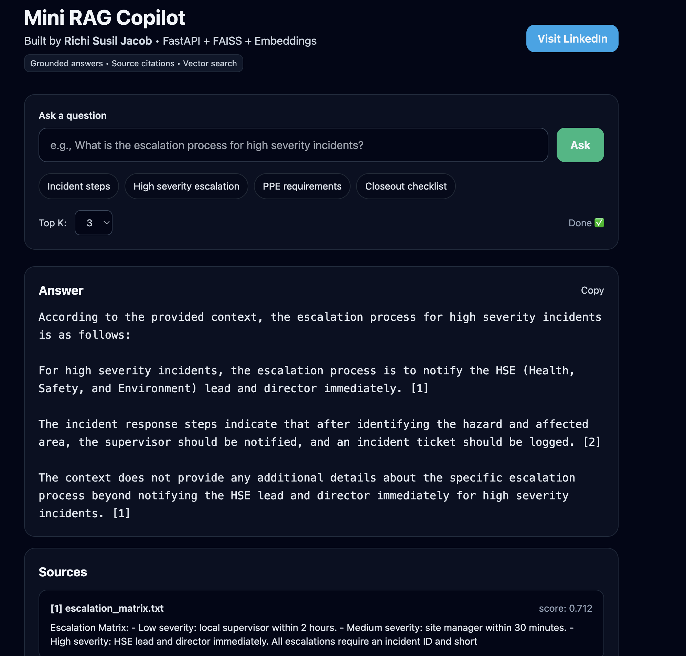
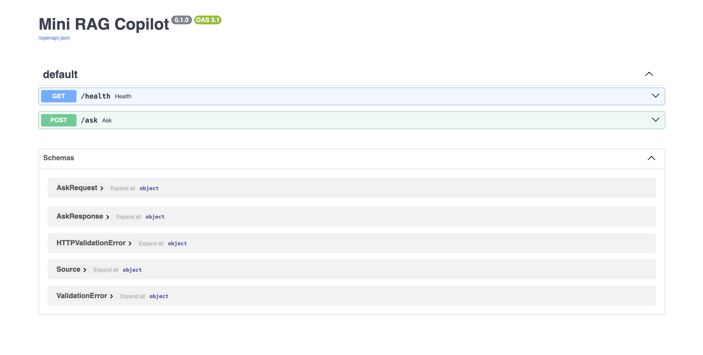
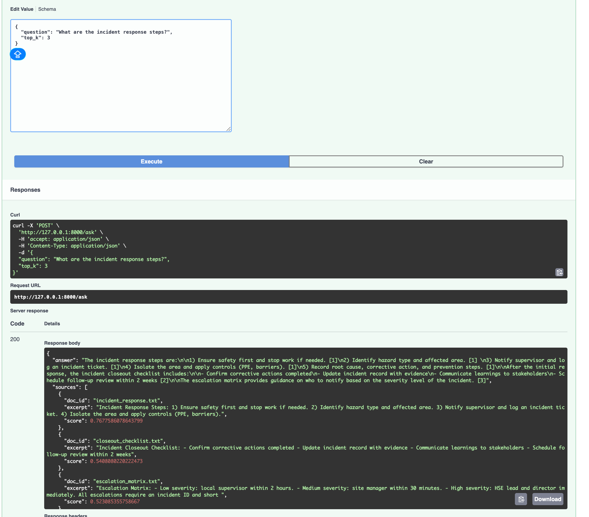
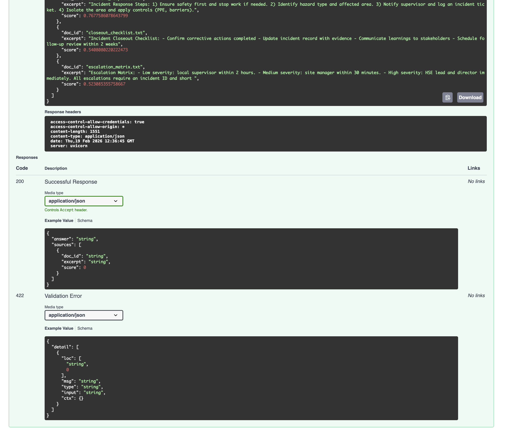
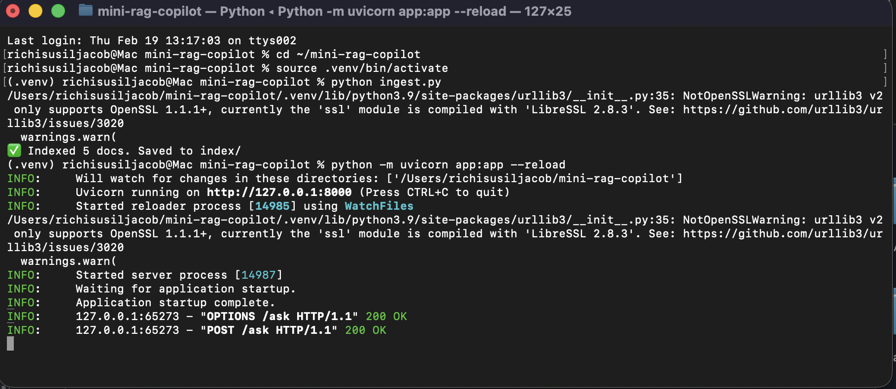

# Mini RAG Copilot (Incident Support Assistant)
**By Richi Susil Jacob**  
LinkedIn: https://www.linkedin.com/in/richi-susil-jacob-06948319a/

A lightweight **AI copilot** that answers **incident / safety / operations** questions using internal documents (SOPs, escalation matrix, checklists, etc.).  
Instead of keyword search, it uses **semantic search** (meaning-based search) to retrieve the most relevant guidance and returns:
- a clear answer
- the supporting sources (with similarity scores), so users can trust where the answer came from

---

## Why I built this
In real ops teams (IT / Oil & Gas / Safety / Support), people need fast answers like:
- “Who do we escalate to for high severity incidents?”
- “What are the incident response steps?”
- “What PPE is required?”

These answers are usually spread across multiple documents. This copilot makes response faster and safer because it shows the evidence (sources).

---

## What this app does (simple steps)
1. Reads documents from `data/docs/`
2. Converts each document into **embeddings** (numbers that represent meaning)
3. Stores embeddings in a **FAISS vector index** (fast similarity search)
4. When you ask a question:
   - it searches the index for the most relevant documents (Top K)
   - it returns an answer + cited sources (document name + excerpt + score)

---

## Key features
✅ Meaning-based search (semantic retrieval)  
✅ Ranked sources with similarity scores (traceable answers)  
✅ FastAPI backend with Swagger docs  
✅ Lightweight Tailwind UI built for fast demonstrations. 
✅ GenAI-ready RAG design (retrieval + optional LLM answer generation)

---

## Tech used
- **Python** (core logic + ingestion + API)
- **FastAPI** (REST API)
- **Uvicorn** (runs the API server)
- **SentenceTransformers** (embeddings)
- **FAISS** (vector search / similarity retrieval)
- **HTML + TailwindCSS** (UI)

---

## Project structure
- `data/docs/` → your documents (.txt)
- `ingest.py` → builds the vector index
- `index/` → saved FAISS index + metadata
- `app.py` → FastAPI backend (`/health`, `/ask`)
- `ui/index.html` → UI frontend

---

## How it works (portfolio explanation)

### Python (the structure)
Python runs the full workflow: document loading → embeddings → FAISS indexing → API responses.

### Documents / dataset (the knowledge base)
Your dataset is the text files inside `data/docs/`. The copilot answers using these documents only.

### Embeddings (turn text into meaning)
Embeddings convert text into vectors so the system can match by meaning, not exact words.

Example:
- Question: “Who do I escalate to urgently?”
- Document: “High severity: HSE lead and director immediately”
Even if wording differs, semantic search can match the meaning.

### FAISS (fast vector search)
FAISS stores all document vectors and quickly retrieves the Top K most similar results for each question.

### FastAPI + UI
FastAPI exposes `/ask` as a REST endpoint. The UI calls this endpoint and displays the answer plus sources.

---

## GenAI (Portfolio Note)
This project follows the **RAG (Retrieval-Augmented Generation)** approach used in enterprise GenAI:
- **Retrieval first:** embeddings + FAISS find the best matching documents.
- **Generation next (optional):** an LLM (Claude / OpenAI / local model) can generate a cleaner, human-style answer using only retrieved context.

This makes answers:
- clearer for non-technical users
- grounded in evidence (sources returned)
- safer (reduced hallucinations)

If information is missing, the copilot should respond:
> “I don’t have enough information in the documents.”


## How to run (local)

### 1) Setup environment
```bash
python3 -m venv .venv
source .venv/bin/activate
python -m pip install -r requirements.txt
```

### 2) Add documents
Put your `.txt` files inside:
```bash
data/docs/
```

### 3) Build the index
```bash
python ingest.py
```

### 4) Run the backend
```bash
python -m uvicorn app:app --reload
```

Open API docs (Swagger):
- http://127.0.0.1:8000/docs

---

## Run the UI
In another terminal:
```bash
cd ui
python3 -m http.server 5500
```

Open the UI:
- http://localhost:5500

---

## Example request and response

POST /ask
{
  "question": "What is the escalation process for high severity incidents?",
  "top_k": 3
}

Example response (simplified)

{
  "answer": "Notify the HSE lead and director immediately. Provide the incident ID and a short summary.",
  "sources": [
    { "doc_id": "escalation_matrix.txt", "score": 0.71 },
    { "doc_id": "incident_response.txt", "score": 0.60 }
  ]
}

## Example questions to try
- “What is the escalation process for high severity incidents?”
- “What are the incident response steps?”
- “What is the incident closeout checklist?”

The response will show the answer and the sources used.

---

## How this helps in real life
This shows skills used in production AI projects:
- data ingestion + preprocessing  
- embeddings + vector search  
- API building (REST)  
- UI integration  
- building trustworthy outputs with sources (important for enterprise AI)

---

## Next improvements (future work)
- Enhance Claude responses with better formatting + stronger grounding + safer fallbacks.  
- Add file upload (PDF/docs)  
- Add user roles + audit logs  
- Deploy to cloud (AWS/Azure) with Docker  

---

## Screenshots
### UI


### API (Swagger)




### Terminal run


## Author
**Richi Susil Jacob**  
LinkedIn: https://www.linkedin.com/in/richi-susil-jacob-06948319a/
